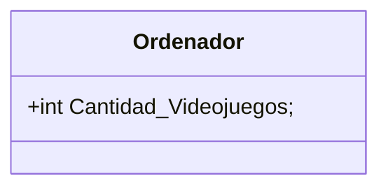

# Diagrama de clases

<<<<<<< HEAD
## Ordenador(PC)
Esta clase va a tener varias acciones, como jugar y trabajar, dentro de el mismo.
=======
## Ordenador (PC)
El siguiente diagrama representa la estructura de clases en la aplicación.
>>>>>>> 4ef6c837f1856e1c4f17defa43aba3a7746f179f

```java
<<<<<<< HEAD
class Ordenador extends {
  int Cantidad_Videojuegos;
  double espacio_disco;
  String Nombre_Videojuegos;
  
  String trabajar(String tipo){
      return null;
  }

  String jugar(String Videojuego){
    return null;
  }
```
Esto es el diagrama del ejercicio anterior:

<<<<<<< HEAD


=======


>>>>>>> 4ef6c837f1856e1c4f17defa43aba3a7746f179f