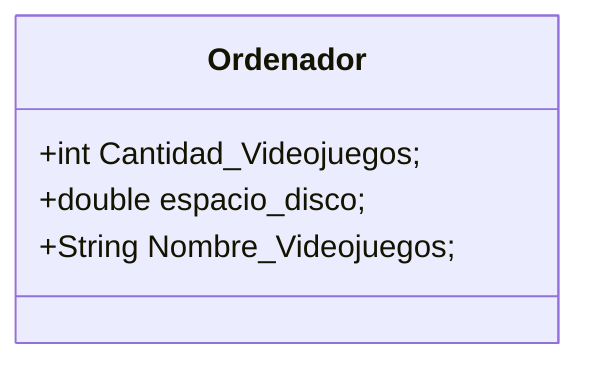

# Diagrama de clases

## Ordenador (PC)
El siguiente diagrama representa la estructura de clases en la aplicación.


```java
class Ordenador {
  int Cantidad_Videojuegos;
  double espacio_disco;
  String Nombre_Videojuegos;
  
  String trabajar(String tipo){
      return null;
  }

  String jugar(String Videojuego){
    return null;
  }
}
```
Esto es el diagrama del ejercicio anterior:


